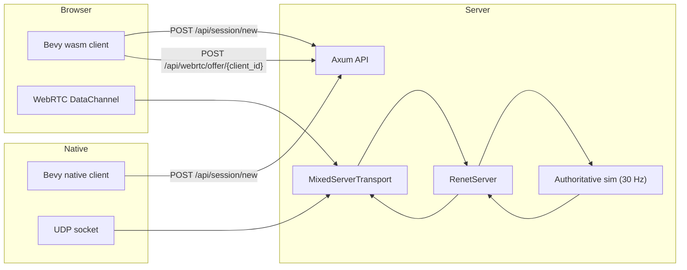

# renet-cross

Transport adapters for Renet 2: native UDP clients and browser WebRTC
DataChannels share one server. The crate handles transport and bootstrap;
prediction, rollback, replication, and hit validation belong in the game.

The WebRTC server uses str0m's synchronous, caller-driven API. Browser channels
are unordered with `maxRetransmits = 0`, leaving message reliability to Renet.
No QUIC, HTTP/3, or game engine integration is required.

See [testing and reproduction](docs/testing.md) and the
[str0m integration assessment](docs/str0m-assessment.md).

## Hybrid Bootstrap (Axum + Authoritative Mixed Transport)

This bootstrap demonstrates one authoritative game server that accepts:
- native UDP clients
- browser WebRTC clients

The game loop and authority are shared, with one `RenetServer` and one `MixedServerTransport` (`udp + webrtc`).

## Use With `renet` (Recommended)

This crate intentionally does **not** re-export `renet`. Users should depend on both crates directly:

```toml
[dependencies]
renet = "2"
renet-cross = "0.7"
```

### Required dependency corrections

This crate uses stock crates.io Renet 2.0.0. Its required correction from the
[Renet repository](https://github.com/dt665m/renet/tree/fix/confirmation-keepalive-starvation)
is in `renetcode`: application payload sends must not postpone KeepAlive retries
before the connection is confirmed. This preserves recovery when the first
handshake KeepAlive is lost, without delaying application flushes in the transport.

The crates.io package depends on registry `renetcode`; it cannot carry a Git
dependency or apply a dependency-level patch to its consumers. Applications using
0.7 must add both overrides at their own workspace root. This checkout repeats
them for its own tests:

```toml
[patch.crates-io]
renetcode = { git = "https://github.com/dt665m/renet.git", branch = "fix/confirmation-keepalive-starvation" }
sctp-proto = { git = "https://github.com/dt665m/sctp-proto.git", rev = "cb94f37991c185fb9cc2fd41fbe92965e2a1f713" }
```

Commit `Cargo.lock` and build with `--locked` to retain the resolved fix commit.
The branch contains the handshake correction and its regression test, with no
Renet configuration extensions. Prefer stock upstream releases; remove this
override when a released renetcode version includes the correction. Keep any
future upstream changes limited to demonstrated correctness fixes or features
appropriate for upstream review.

### Explicit development server helper

```rust
use std::{net::SocketAddr, time::Duration};

use renet::{ConnectionConfig, RenetServer, ServerEvent};
use renet_cross::{
    BootstrapConfig, BootstrapService, MixedTransportBuilder, MonotonicClientIdAllocator,
    ServerAuthentication, UnsecureDevAuthPolicy,
};

let protocol_id = 7;
let mut server = RenetServer::new(ConnectionConfig::default());

let mut transport = MixedTransportBuilder::new(protocol_id)
    .udp_bind("0.0.0.0:5000".parse::<SocketAddr>()?)
    .webrtc_bind("0.0.0.0:5001".parse::<SocketAddr>()?)
    .public_udp_addr("127.0.0.1:5000".parse()?)
    .public_webrtc_addr("127.0.0.1:5001".parse()?)
    .max_clients(512)
    .authentication(ServerAuthentication::Unsecure)
    .build()?;

let bootstrap = BootstrapService::new(
    BootstrapConfig {
        session_ttl: Duration::from_secs(120),
        public_udp_addr: "127.0.0.1:5000".parse()?,
        public_webrtc_addr: "127.0.0.1:5001".parse()?,
        public_http_base: "http://127.0.0.1:8080".to_string(),
    },
    MonotonicClientIdAllocator::new(1),
    UnsecureDevAuthPolicy,
);

// In your tick:
// server.update(dt);
// transport.update(dt, &mut server)?;
// while let Some(event) = server.get_event() { match event { ... } }
// transport.send_packets(&mut server);
```

### Native client setup helper

```rust
use std::time::Duration;

use renet::RenetClient;
use renet_cross::{connect_via_session_http_blocking, NativeConnectOptions};

let (mut client, mut transport, _client_id): (_, _, u64) =
    connect_via_session_http_blocking(
        "http://127.0.0.1:8080",
        7,
        NativeConnectOptions::default(),
    )?;

let dt = Duration::from_millis(16);
client.update(dt);
transport.update(dt, &mut client)?;
transport.send_packets(&mut client)?;
```

### Axum helper (optional)

With feature `axum`, use `bootstrap_router(...)` with your `BootstrapService` and `MixedServerTransport` to expose:
- `GET /healthz`
- `POST /api/session/new`
- `POST /api/webrtc/offer/{client_id}`

## Architecture



## HTTP and Signaling Flow

1. `POST /api/session/new`
- accepts an optional bounded `SessionCreateRequest` JSON body and returns endpoint addresses, an SDP session token, and an optional secure token envelope. Empty bodies remain the explicit legacy development path.

2. Browser only: `POST /api/webrtc/offer/{client_id}`
- request: `{ "sdp": "...offer..." }`
- response: `{ "client_id": <u64>, "sdp": "...answer..." }`

3. Native client
- selects the UDP connect token from a secure response; `require_secure` rejects a missing envelope. Legacy development responses use unsecure netcode only when explicitly permitted.

## Tick Order (Authoritative)

Per tick (`30 Hz` in the example; the transport does not impose a simulation rate):
1. `server.update(dt)`
2. `transport.update(dt, &mut server)`
3. process connect/disconnect and input messages
4. `sim.step()`
5. broadcast `WorldDelta` (`DefaultChannel::Unreliable`)
6. `transport.send_packets(&mut server)`

## Startup Steps

### 1. Run server

```bash
just -f examples/justfile server
```

Optional CLI flags (also supported via env fallback):
- `--http-bind` (`NET_HTTP_BIND`, default `0.0.0.0:8080`)
- `--udp-bind` (`NET_UDP_BIND`, default `0.0.0.0:5000`)
- `--webrtc-bind` (`NET_WEBRTC_BIND`, default `0.0.0.0:5001`)
- `--public-http-base` (`NET_PUBLIC_HTTP_BASE`, default `http://127.0.0.1:8080`)
- `--public-udp-addr` (`NET_PUBLIC_UDP_ADDR`, default `127.0.0.1:5000`)
- `--public-webrtc-addr` (`NET_PUBLIC_WEBRTC_ADDR`, default `127.0.0.1:5001`)
- `--client-dist` (`NET_CLIENT_DIST`, default `examples/client/dist`)

### 2. Run native client

```bash
just -f examples/justfile desktop-client
```

Optional client flag:
- `--http-base` (`NET_HTTP_BASE`, default `http://127.0.0.1:8080`)

### 3. Run wasm client (Trunk)

```bash
cd examples/client
trunk serve --open
```

The wasm client posts to the current page origin by default (or fallback `http://127.0.0.1:8080`).

## Why `client_id` Exists

`client_id` is connection identity, not transport identity.

- transport decides how bytes move (`UDP` or `WebRTC`)
- `client_id` decides which logical player/connection those bytes belong to in `RenetServer`

Both transports can coexist because both eventually map incoming/outgoing packets to the same authoritative `client_id` model.

This bootstrap uses `MonotonicClientIdAllocator` (in-memory, monotonic) as a dev default.

## Failure Mapping

Current API behavior:
- duplicate WebRTC offer id -> `409 Conflict`
- invalid SDP offer -> `400 Bad Request`
- ICE/RTC negotiation errors -> `422 Unprocessable Entity`

Unknown/expired session ids return `404` in the server example.

## Secure bootstrap and admission

`SecureSessionAuthPolicy<V>` uses renetcode's `ConnectToken` encryption and key
primitives. The host supplies a `SessionAdmission` verifier; the library does not
pretend to validate accounts. Implement `admit(&SessionCreateRequest, Duration)`
to verify the credential and its fixed expiry, check the requested protocol,
service and match, and return a `SessionGrant`. Its `replay_key` must identify the
same one-use admission ticket on every retry, rather than generating a new key
for a replayed credential. An explicitly chosen guest verifier may admit empty
credentials and create a fresh grant, but that authenticates no account.

The grant includes `protocol_id`, `service`, `match_id`, `expires_at`, a 32-byte
`replay_key`, and up to 128 bytes of opaque `application` data. Service, match,
protocol, expiry and application bytes are embedded in authenticated netcode
`user_data`. Use the same private key for `SecureSessionAuthPolicy::new(verifier,
key)` and the mixed transport's `ServerAuthentication::Secure { private_key:
key }`. The verifier must issue expiry no later than `BootstrapConfig.session_ttl`.
Never include the private key in a client build or bootstrap response.

`BootstrapService::create_session_with_request(&request)` returns separate UDP
and WebRTC connect tokens because their selected endpoints differ. Its random
SDP `session_token` is tied to that same admitted session. An offer claim is
single-use, including a malformed offer after successful authorization; recovery
requests a new admission ticket. A session activates once, before its grant
expires. On a netcode connection event, the host **must** call
`on_client_connected_with_user_data(client_id, &transport_user_data)` and reject
an error before adding that client to gameplay. The existing
`on_client_connected(client_id)` cannot activate a secure session. Use
`session_grant(client_id)` for the application grant and
`on_client_disconnected(client_id)` for cleanup. Replay fences remain until the
grant expires, including after disconnect. Transport handshake completion alone
is not game admission.

Both `NativeConnectOptions` and `WebRtcConnectOptions` expose `session_request`
and `require_secure`. Set the latter to `true` for secure clients:

```rust
use renet_cross::{NativeConnectOptions, SessionCreateRequest};
let options = NativeConnectOptions {
    require_secure: true,
    session_request: SessionCreateRequest {
        protocol_id: Some(77),
        service: "my-service".into(),
        match_id: "my-match".into(),
        credential: "ticket-from-your-auth-service".into(),
        require_secure: true,
    },
    ..Default::default()
};
```

The blocking, async and browser HTTP helpers forward this bounded JSON request
and reject HTTP redirects so credentials are not forwarded to another endpoint.
`connect_from_session` is also public on native targets without HTTP features,
and `connect_webrtc_from_session` accepts an app-owned endpoint response in the
browser. They validate client ID, protocol, selected endpoint and expiry before
connecting. A present malformed secure envelope never falls back to unsecure;
supplying authentication fields also forbids fallback even when the option's
boolean is false. Address overrides must match the token's exact endpoint.
Parsing a public token is not server authentication; renetcode checks its
private authenticated data during the handshake.

Terminate HTTPS at the service or its trusted reverse proxy when issuing tokens
and forwarding credentials outside local development. The supplied Axum router
is an HTTP router and does not install TLS. Set `public_http_base` to the public
HTTPS origin; SDP tokens and connect tokens are bearer credentials. Diagnostic
formatting and HTTP errors omit credential/token contents. Existing empty-body
helpers plus `UnsecureDevAuthPolicy` remain available for explicit local tests;
they reject any request that asks for authenticated/secure admission.

`BootstrapLimits` independently caps pending sessions (default 1,024), active
sessions (256), and retained admission replay keys (8,192).
`BootstrapService::with_limits` configures these caps. Run `cleanup_sessions`
regularly and notify disconnections; active entries are not automatically
removed just because an admission token expires. Request JSON is capped at
8 KiB, credential text at 4 KiB, session response JSON at 16 KiB and SDP JSON at
64 KiB. Native and browser clients read response bodies with bounded accumulation.
Axum enforces body limits before JSON extraction; app-owned HTTP endpoints must
apply the same limits. No unbounded application ticket cache or custom crypto is
introduced.

## Browser configuration and local limits

Existing `connect_via_sdp_http` and `connect_via_sdp_http_with_overrides` helpers
keep their signatures. Use `connect_via_sdp_http_with_options` on wasm for explicit
ICE servers, TURN credentials, Renet channel configuration, and queue limits:

```rust
use renet_cross::{WebRtcConnectOptions, WebRtcIceServer};

let options = WebRtcConnectOptions {
    ice_servers: vec![WebRtcIceServer {
        urls: vec!["turn:relay.example.com:3478?transport=udp".into()],
        username: Some("issued-user".into()),
        credential: Some("short-lived-credential".into()),
    }],
    max_buffered_amount: 64 * 1024,
    max_inbox_packets: 256,
    ..Default::default()
};
// On wasm:
// let (client, transport, id) =
//     renet_cross::connect_via_sdp_http_with_options(base_http, protocol_id, options).await?;
```

Defaults keep the original Google STUN servers. An empty ICE server list uses
host candidates only. Configuring TURN enables the browser to gather relay
candidates; an accessible relay and appropriate credentials are still required.
This is not a guarantee of operation on networks that block the server's UDP path.

The browser drops outgoing packets that would exceed the configured buffer
budget, rejects oversized incoming netcode packets, and drops the oldest queued
packet when the inbox fills. Renet retries reliable messages; unreliable messages
may be lost. `transport.stats()` distinguishes these local drops from Renet's
network metrics. Dropping the transport closes the peer connection.

Native client/server receive loops default to 256 datagram attempts per update.
`set_max_datagrams_per_update(NonZeroUsize)` tunes that budget. Remaining datagrams
stay in the OS queue while protocol timers continue to advance. The WebRTC pump
also has bounded ingest/drain work and drops excess ingress instead of building
an unbounded queue. Pump networking frequently; a low-frequency game tick need
not be the network pump frequency.

The SDP helper counts pending negotiations toward the WebRTC backend's client
capacity and returns HTTP 503 when full. Builder `max_clients` is per backend,
not a combined mixed-server player limit. Low-level `add_peer` is an advanced
API; callers are responsible for admission control when bypassing SDP helpers.

Optional development tooling: [packet conditioner and Bevy debug UI](docs/conditioner-ui.md).

Development server controls: [server packet conditioning](docs/server-conditioner.md).

## Runtime packet tooling and Bevy UI

Starting with 0.6.0, `renet-cross` has no Bevy dependency. Packet
conditioning is configured at runtime via `ClientTransportConfig` or
`ServerTransportConfig`; the old conditioner/UI Cargo features are removed.
Use `new_with_config` on standalone transports, `.transport` on client bootstrap
options, or `.transport_config(...)` on `MixedTransportBuilder`.

Applications that want the built-in Bevy panel explicitly depend on the companion
[`bevy-net-debug`](crates/bevy-net-debug) crate and import
`bevy_net_debug::{ConditionerDebug, ConditionerDebugPlugin}`. Pass the same
configured handle to the transport and panel. Headless consumers need only core.
See the [migration and setup guide](docs/conditioner-ui.md).

## License

Licensed under either the [MIT License](LICENSE-MIT) or the
[Apache License, Version 2.0](LICENSE-APACHE), at your option.

## Transport send cadence

The default Renet profile preserves upstream 2.0.0 packetization. This checkout
also supports [bounded packet profiles](docs/packet-budgets.md) through the owned
Renet fork. Call `send_packets` once per application
frame or regular network tick; the [upstream README example](https://github.com/lucaspoffo/renet#usage)
uses approximately 60 Hz, and `bevy_renet` flushes in `PostUpdate`. This transport does not impose a
send timer. If a headless loop polls sockets more frequently, schedule Renet packet
generation separately rather than flushing on every poll. Continue servicing it
when gameplay is paused or no replication update is due.

Renet can generate ACK packets while it retains receipt history, so calling
`send_packets` in a 1 ms polling loop can generate excessive control traffic.
Diagnostics expose upstream Renet's statistics unchanged: packet loss estimates
outgoing unacknowledged packets, including ACK-only packets, and is not an IP-layer
drop measurement.


## Temporary SCTP correction

Version 0.6.1 adds bounded transport tracing and documents an application-level
workaround for premature SCTP abandonment. **Installing 0.6.1 alone does not
include the unpublished SCTP fix.** While the upstream fix is pending, add this
override to your application's workspace-root `Cargo.toml`:

```toml
[patch.crates-io.sctp-proto]
git = "https://github.com/dt665m/sctp-proto.git"
rev = "cb94f37991c185fb9cc2fd41fbe92965e2a1f713"
```

Then update the lockfile with `cargo update -p sctp-proto`. The exact commit
implements the PR-SCTP retry limit at the retransmission boundary and shares
abandonment across message fragments. It prevents premature FORWARD-TSN and
acknowledgement amplification during ordinary traffic. See
[upstream PR #57](https://github.com/algesten/sctp-proto/pull/57).

Cargo only honors `[patch]` at the consuming workspace root. The override in
this repository applies to its own development builds; it is not inherited by
downstream users and is not a registry dependency in the published package.
Remove the override once a published dependency chain requires the upstream fix.
Renet remains unmodified registry 2.0.0.

For temporary native packet correlation, enable the log target
`renet_cross::packet_trace=trace`. It emits at most 100,000 records per process
across all peers: client ID, event, encrypted packet length and a fingerprint.
It records data-channel sends/receives and local quota/input/send failures,
without logging packet contents. Leave this target disabled for normal use.
