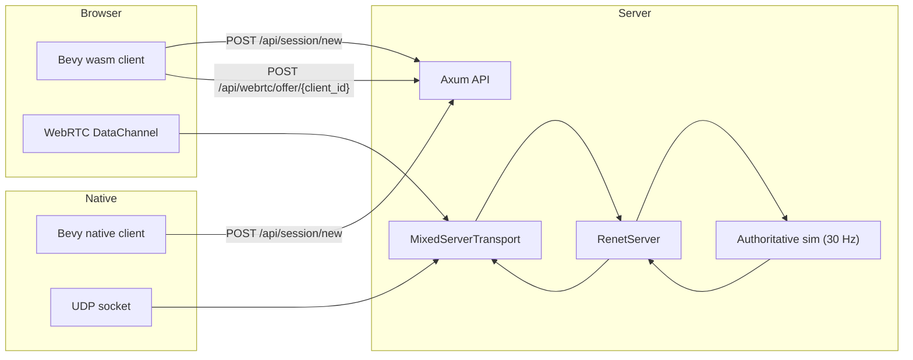

# renet-cross

Transport adapters for Renet 2: native UDP clients and browser WebRTC
DataChannels share one server. The crate handles transport and bootstrap;
prediction, rollback, replication, and hit validation belong in the game.

The WebRTC server uses str0m's synchronous, caller-driven API. Browser channels
are unordered with `maxRetransmits = 0`, leaving message reliability to Renet.
No QUIC, HTTP/3, or game engine integration is required.

See [testing and reproduction](docs/testing.md) and the
[str0m integration assessment](docs/str0m-assessment.md).

## Hybrid Bootstrap (Axum + Authoritative Mixed Transport)

This bootstrap demonstrates one authoritative game server that accepts:
- native UDP clients
- browser WebRTC clients

The game loop and authority are shared, with one `RenetServer` and one `MixedServerTransport` (`udp + webrtc`).

## Use With `renet` (Recommended)

This crate intentionally does **not** re-export `renet`. Users should depend on both crates directly:

```toml
[dependencies]
renet = "2"
renet-cross = "0.4"
```

### Server setup helper

```rust
use std::{net::SocketAddr, time::Duration};

use renet::{ConnectionConfig, RenetServer, ServerEvent};
use renet_cross::{
    BootstrapConfig, BootstrapService, MixedTransportBuilder, MonotonicClientIdAllocator,
    ServerAuthentication, UnsecureDevAuthPolicy,
};

let protocol_id = 7;
let mut server = RenetServer::new(ConnectionConfig::default());

let mut transport = MixedTransportBuilder::new(protocol_id)
    .udp_bind("0.0.0.0:5000".parse::<SocketAddr>()?)
    .webrtc_bind("0.0.0.0:5001".parse::<SocketAddr>()?)
    .public_udp_addr("127.0.0.1:5000".parse()?)
    .public_webrtc_addr("127.0.0.1:5001".parse()?)
    .max_clients(512)
    .authentication(ServerAuthentication::Unsecure)
    .build()?;

let bootstrap = BootstrapService::new(
    BootstrapConfig {
        session_ttl: Duration::from_secs(120),
        public_udp_addr: "127.0.0.1:5000".parse()?,
        public_webrtc_addr: "127.0.0.1:5001".parse()?,
        public_http_base: "http://127.0.0.1:8080".to_string(),
    },
    MonotonicClientIdAllocator::new(1),
    UnsecureDevAuthPolicy,
);

// In your tick:
// server.update(dt);
// transport.update(dt, &mut server)?;
// while let Some(event) = server.get_event() { match event { ... } }
// transport.send_packets(&mut server);
```

### Native client setup helper

```rust
use std::time::Duration;

use renet::RenetClient;
use renet_cross::{connect_via_session_http_blocking, NativeConnectOptions};

let (mut client, mut transport, _client_id): (_, _, u64) =
    connect_via_session_http_blocking(
        "http://127.0.0.1:8080",
        7,
        NativeConnectOptions::default(),
    )?;

let dt = Duration::from_millis(16);
client.update(dt);
transport.update(dt, &mut client)?;
transport.send_packets(&mut client)?;
```

### Axum helper (optional)

With feature `axum`, use `bootstrap_router(...)` with your `BootstrapService` and `MixedServerTransport` to expose:
- `GET /healthz`
- `POST /api/session/new`
- `POST /api/webrtc/offer/{client_id}`

## Architecture



## HTTP and Signaling Flow

1. `POST /api/session/new`
- returns `SessionCreateResponse { client_id, udp_addr, webrtc_addr, webrtc_offer_url, session_token? }`

2. Browser only: `POST /api/webrtc/offer/{client_id}`
- request: `{ "sdp": "...offer..." }`
- response: `{ "client_id": <u64>, "sdp": "...answer..." }`

3. Native client
- uses `udp_addr` with unsecure netcode auth for local/dev bootstrap

## Tick Order (Authoritative)

Per tick (`30 Hz` in the example; the transport does not impose a simulation rate):
1. `server.update(dt)`
2. `transport.update(dt, &mut server)`
3. process connect/disconnect and input messages
4. `sim.step()`
5. broadcast `WorldDelta` (`DefaultChannel::Unreliable`)
6. `transport.send_packets(&mut server)`

## Startup Steps

### 1. Run server

```bash
just -f examples/justfile server
```

Optional CLI flags (also supported via env fallback):
- `--http-bind` (`NET_HTTP_BIND`, default `0.0.0.0:8080`)
- `--udp-bind` (`NET_UDP_BIND`, default `0.0.0.0:5000`)
- `--webrtc-bind` (`NET_WEBRTC_BIND`, default `0.0.0.0:5001`)
- `--public-http-base` (`NET_PUBLIC_HTTP_BASE`, default `http://127.0.0.1:8080`)
- `--public-udp-addr` (`NET_PUBLIC_UDP_ADDR`, default `127.0.0.1:5000`)
- `--public-webrtc-addr` (`NET_PUBLIC_WEBRTC_ADDR`, default `127.0.0.1:5001`)
- `--client-dist` (`NET_CLIENT_DIST`, default `examples/client/dist`)

### 2. Run native client

```bash
just -f examples/justfile desktop-client
```

Optional client flag:
- `--http-base` (`NET_HTTP_BASE`, default `http://127.0.0.1:8080`)

### 3. Run wasm client (Trunk)

```bash
cd examples/client
trunk serve --open
```

The wasm client posts to the current page origin by default (or fallback `http://127.0.0.1:8080`).

## Why `client_id` Exists

`client_id` is connection identity, not transport identity.

- transport decides how bytes move (`UDP` or `WebRTC`)
- `client_id` decides which logical player/connection those bytes belong to in `RenetServer`

Both transports can coexist because both eventually map incoming/outgoing packets to the same authoritative `client_id` model.

This bootstrap uses `MonotonicClientIdAllocator` (in-memory, monotonic) as a dev default.

## Failure Mapping

Current API behavior:
- duplicate WebRTC offer id -> `409 Conflict`
- invalid SDP offer -> `400 Bad Request`
- ICE/RTC negotiation errors -> `422 Unprocessable Entity`

Unknown/expired session ids return `404` in the server example.

## Future Hardening (Production Path)

The supplied HTTP connection helpers use `ClientAuthentication::Unsecure`.
`SessionAuthPolicy` authenticates signaling; its session token is not a secure
netcode connect token. Native low-level construction accepts
`ClientAuthentication::Secure`. A complete authenticated browser bootstrap is
still application/integration work. TURN credentials also do not authenticate a
game account.

Move from in-memory monotonic IDs to signed, time-bounded issuance:
1. mint signed session/bootstrap tokens from trusted auth service
2. bind token to `client_id`, audience, expiry, and optional device/account context
3. verify token server-side before creating transport peer
4. replace unsecure connect auth with secure token issuance and key rotation

This keeps transport-agnostic identity while making bootstrap secure and replay-resistant.

## Browser configuration and local limits

Existing `connect_via_sdp_http` and `connect_via_sdp_http_with_overrides` helpers
keep their signatures. Use `connect_via_sdp_http_with_options` on wasm for explicit
ICE servers, TURN credentials, Renet channel configuration, and queue limits:

```rust
use renet_cross::{WebRtcConnectOptions, WebRtcIceServer};

let options = WebRtcConnectOptions {
    ice_servers: vec![WebRtcIceServer {
        urls: vec!["turn:relay.example.com:3478?transport=udp".into()],
        username: Some("issued-user".into()),
        credential: Some("short-lived-credential".into()),
    }],
    max_buffered_amount: 64 * 1024,
    max_inbox_packets: 256,
    ..Default::default()
};
// On wasm:
// let (client, transport, id) =
//     renet_cross::connect_via_sdp_http_with_options(base_http, protocol_id, options).await?;
```

Defaults keep the original Google STUN servers. An empty ICE server list uses
host candidates only. Configuring TURN enables the browser to gather relay
candidates; an accessible relay and appropriate credentials are still required.
This is not a guarantee of operation on networks that block the server's UDP path.

The browser drops outgoing packets that would exceed the configured buffer
budget, rejects oversized incoming netcode packets, and drops the oldest queued
packet when the inbox fills. Renet retries reliable messages; unreliable messages
may be lost. `transport.stats()` distinguishes these local drops from Renet's
network metrics. Dropping the transport closes the peer connection.

Native client/server receive loops default to 256 datagram attempts per update.
`set_max_datagrams_per_update(NonZeroUsize)` tunes that budget. Remaining datagrams
stay in the OS queue while protocol timers continue to advance. The WebRTC pump
also has bounded ingest/drain work and drops excess ingress instead of building
an unbounded queue. Pump networking frequently; a low-frequency game tick need
not be the network pump frequency.

The SDP helper counts pending negotiations toward the WebRTC backend's client
capacity and returns HTTP 503 when full. Builder `max_clients` is per backend,
not a combined mixed-server player limit. Low-level `add_peer` is an advanced
API; callers are responsible for admission control when bypassing SDP helpers.
